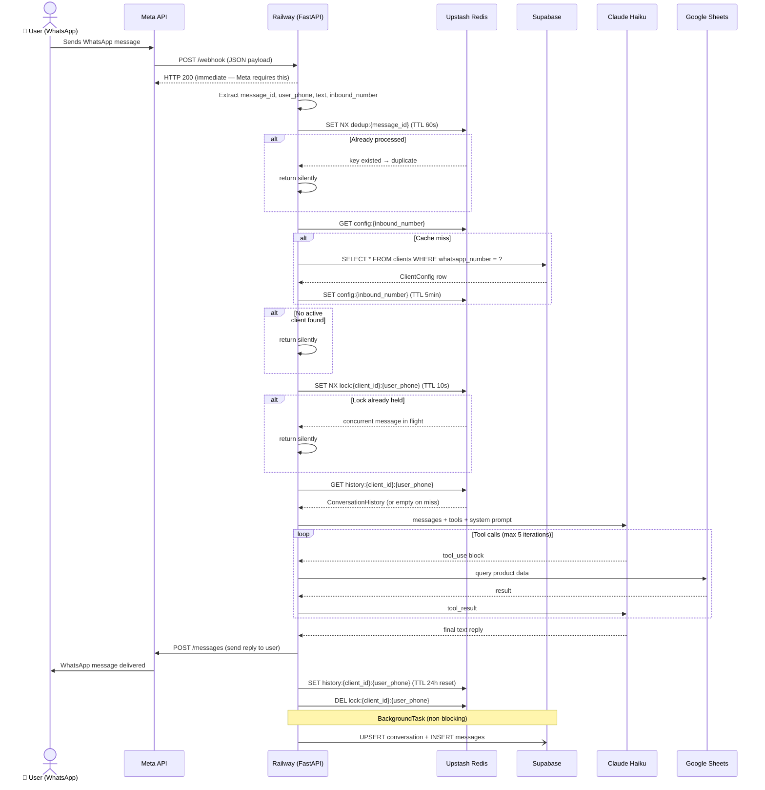
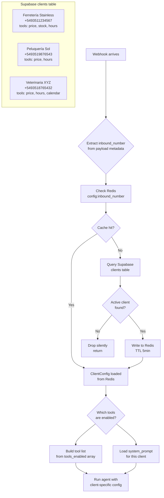
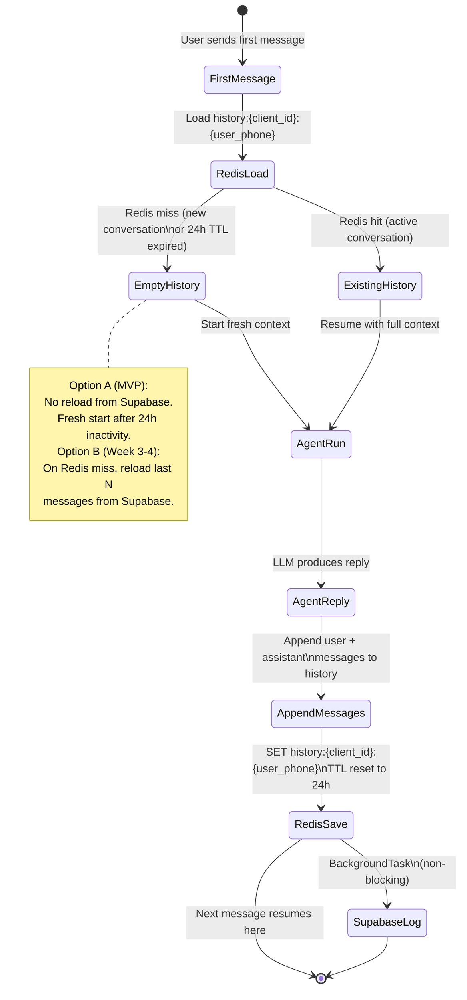
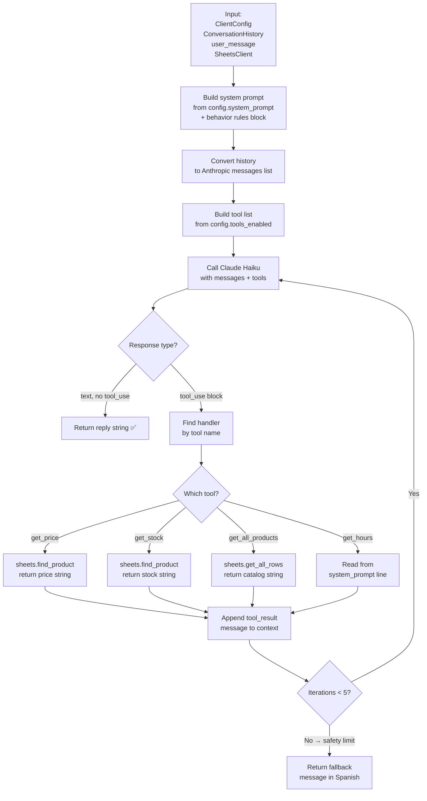
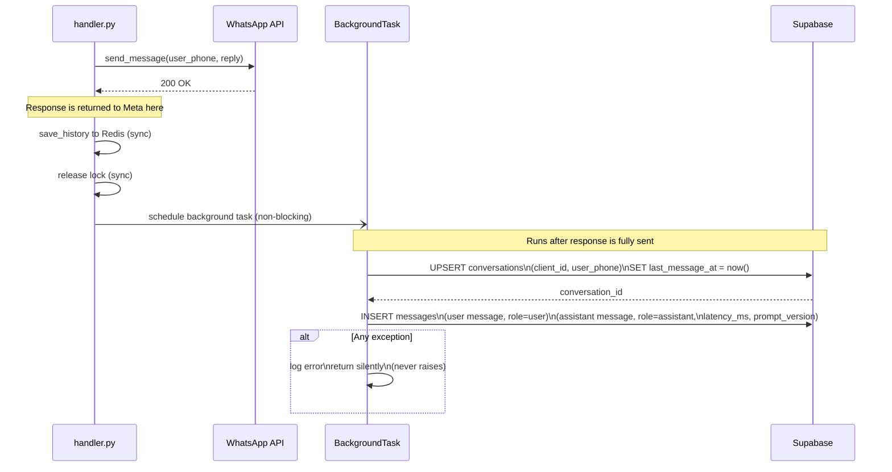
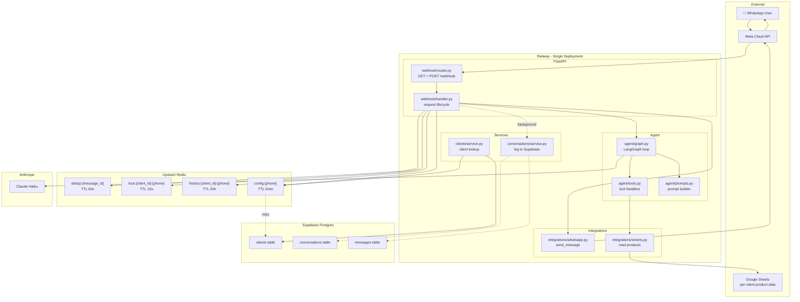

# AI Receptionist — System Flows

## Table of Contents
1. [Webhook Request Lifecycle](#1-webhook-request-lifecycle)
2. [Multi-Tenancy & Client Identification](#2-multi-tenancy--client-identification)
3. [Deduplication & Locking](#3-deduplication--locking)
4. [Conversation Memory](#4-conversation-memory)
5. [Agent Loop](#5-agent-loop)
6. [Background Persistence](#6-background-persistence)
7. [Full System Map](#7-full-system-map)

---

## 1. Webhook Request Lifecycle

Every inbound WhatsApp message follows this exact sequence. Steps 1–8 are on the critical path (user is waiting). Step 9 runs in the background after the reply is sent.



---

## 2. Multi-Tenancy & Client Identification

One deployed codebase serves N clients. The client is identified at request time from the inbound phone number — no routing config, no code changes needed to add a client.



**Key rule:** Adding a new client = one `INSERT` into `clients`. Zero code changes. Zero redeploys.

---

## 3. Deduplication & Locking

Two separate Redis mechanisms protect against two different problems.

```mermaid
flowchart LR
    subgraph Problem 1 — Meta retries the same message
        A1[Message arrives\nmessage_id = wamid.abc] --> B1[SET NX dedup:wamid.abc\nTTL 60s]
        B1 --> C1{Key existed?}
        C1 -- No, inserted → first time --> D1[Process message ✅]
        C1 -- Yes, existed → retry --> E1[Drop silently ✅]
    end

    subgraph Problem 2 — User sends two messages in 200ms
        A2[Message 1 arrives] --> B2[SET NX lock:client:phone\nTTL 10s]
        B2 --> C2{Lock acquired?}
        C2 -- Yes --> D2[Process message 1\nhold lock]
        D2 --> E2[Release lock\nDEL lock:client:phone]

        A3[Message 2 arrives\n200ms later] --> B3[SET NX lock:client:phone]
        B3 --> C3{Lock acquired?}
        C3 -- No, locked --> F3[Drop silently ✅]
    end
```

**Why two mechanisms?**

| | Dedup | Lock |
|---|---|---|
| Protects against | Meta webhook retries | Concurrent msgs from same user |
| Key | `dedup:{message_id}` | `lock:{client_id}:{user_phone}` |
| TTL | 60s | 10s |
| On conflict | Drop | Drop |
| Fail behavior | Fail open (process anyway) | Fail closed (drop) |

---

## 4. Conversation Memory

Redis is the working memory. Supabase is the permanent log. They serve different purposes and are never used interchangeably.



**Redis key TTL behavior:**

```
User sends msg at 10:00 → history TTL set to 24h → expires 10:00 next day
User sends msg at 14:00 → history TTL reset to 24h → expires 14:00 next day
User sends msg at 23:50 → history TTL reset to 24h → expires 23:50 next day
User goes silent for 25h → key expires → next message starts fresh
```

---

## 5. Agent Loop

The LangGraph graph is a simple loop with a hard iteration cap. No LangGraph state persistence — all state enters and exits as plain Python objects.



**Example multi-step tool call:**

```
User:  "cuánto sale el tornillo 6x50 y hay stock?"

Turn 1 → LLM decides to call get_price("tornillo 6x50")
       → Sheets returns "$15 por unidad"
       → tool_result appended

Turn 2 → LLM decides to call get_stock("tornillo 6x50")
       → Sheets returns "850 unidades en stock"
       → tool_result appended

Turn 3 → LLM produces final text:
         "El tornillo 6x50 sale $15 por unidad y tenemos 850 en stock 🔩"

Total: 3 LLM calls, 2 tool calls, 1 reply
```

---

## 6. Background Persistence

Supabase writes never block the user response. They run after the reply is already sent.



**What gets logged per conversation turn:**

```
conversations row:
  client_id, user_phone, last_message_at → updated on every message

messages rows (2 inserted per turn):
  role=user,      content="cuánto sale el tornillo?"  latency_ms=null
  role=assistant, content="El tornillo sale $15...",   latency_ms=1843, prompt_version=1
```

---

## 7. Full System Map

How all components relate to each other at runtime.



--- 

## Component Responsibility Summary

| File | Responsibility | Touches |
|---|---|---|
| `webhook/router.py` | HTTP layer only — routes, verification, always-200 | FastAPI |
| `webhook/handler.py` | Full request lifecycle orchestration | Everything |
| `agent/graph.py` | LangGraph loop — LLM calls + tool dispatch | Anthropic, tools |
| `agent/tools.py` | Tool definitions + handlers | Sheets |
| `agent/prompts.py` | Build final system prompt string | ClientConfig |
| `clients/service.py` | Client lookup with cache | Supabase, Redis |
| `conversations/service.py` | Async Supabase logging | Supabase |
| `context/redis.py` | History, lock, dedup | Redis |
| `integrations/sheets.py` | Read product data | Google Sheets |
| `integrations/whatsapp.py` | Send messages | Meta API |
| `dependencies.py` | FastAPI DI wiring | All clients |
| `config.py` | Env var validation — crash on missing | — |